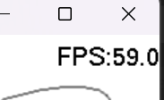

# Simple Paint

使用 C、OpenGL、GLU 與 FreeGLUT 製作的簡易繪圖程式，支援自由描線、基本圖形、文字、橡皮擦與 BMP 存檔。預設為白色畫布、黑色畫筆，視窗大小為 400 × 400。

## 程式架構

`src` 存放功能實作；`include` 存放函式與資料型別宣告，兩者皆位於專案根目錄。

```text
src/                                       include/
├── main.c       # 主程式與事件處理         ├── pen.h        # 畫筆、形狀與顏色設定
├── draw.c       # 圖形繪製                 ├── draw.h       # 繪圖介面
├── menu.c       # 右鍵選單                 ├── menu.h       # 選單介面
├── type.c       # 文字輸入與繪製           ├── type.h       # 文字介面
├── Mrwithe.c    # 橡皮擦                   ├── Mrwithe.h    # 橡皮擦介面
├── canvas_io.c  # 畫布快取與 BMP 存檔      ├── canvas_io.h  # 快取與存檔介面
└── overlay.c    # 格線與 FPS               └── overlay.h    # 格線與 FPS 介面
```

## 基礎功能

### Hierarchical menus

按滑鼠右鍵開啟階層式選單。

| 選項 | 功能 |
| --- | --- |
| Brush | Dot 圓形筆刷、Square 方形筆刷 |
| Shape | None、Line、Triangle、Triangle Outline、Circle |
| Color | 紅、藍、綠、黃、黑 |
| Line Width | 線寬：1、2、4、8、16 px |
| Point Size | 筆刷大小：1、2、4、8、16 px |
| Type | 新增文字 |
| Eraser | 橡皮擦 |
| Save → BMP | 儲存畫布 |
| Clear Canvas | 清除畫布與未完成的輸入 |
| Quit | 結束程式 |

Brush、Shape、Color 與尺寸子選單會用 `[x]` 標示目前選項，父選單也會顯示目前設定。Type 與 Eraser 是操作項目，沒有選取標記。


```c
# menus.c
glutAddSubMenu("Brush", brush_menu);
glutAddSubMenu("Shape", shape_menu);
glutAttachMenu(GLUT_RIGHT_BUTTON);
```

`refresh_selection()` 更新選項文字；工具切換與存檔透過 callback 通知主程式。


### 畫筆（自由曲線）

先選 **Shape → None**，再選 **Brush → Dot / Square**，按住左鍵拖曳繪圖。Point Size 決定圓點直徑或方形邊長，Color 決定顏色。

滑鼠移動時，用線性插值補上兩次事件之間的點，將資料存入陣列，再逐點繪製。Dot 使用 `gluDisk()`，Square 使用 `GL_QUADS`。


```c
# draw.c
float t = (float)i / steps;
int px = (int)lroundf(last_x + dx * t);
int py = (int)lroundf(last_y + dy * t);
points->meta[points->count++] = (Point){px, py, pnt_size, pnt_color, brush};
```


### Polygons 與基本圖形

| Shape 選項 | 使用方式 | 繪製方式 |
| --- | --- | --- |
| Line | 左鍵依序點選起點、終點 | `GL_LINES` |
| Triangle | 左鍵依序點選三個頂點 | `GL_TRIANGLES`，填滿內部 |
| Triangle Outline | 左鍵依序點選三個頂點 | `GL_LINE_LOOP`，只畫邊線 |
| Circle | 左鍵點選圓心 | `gluDisk()`，半徑固定 15 px |

空心三角形的三個頂點另加實心圓點，圓點直徑與 Line Width 相同。圖形保留建立時的顏色與相關尺寸，切換工具會取消尚未完成的頂點輸入。目前多邊形功能以三角形為主。

```c
glBegin(misumi->outline ? GL_LINE_LOOP : GL_TRIANGLES);
for (int j = 0; j < 3; ++j) {
    glVertex2i(misumi->vertices[j].x,
               height - misumi->vertices[j].y);
}
glEnd();
```


## 進階功能

### FPS

[overlay.c](src/overlay.c) 使用 `glutGet(GLUT_ELAPSED_TIME)` 計算經過時間，約每 500 毫秒更新右上角的 FPS 顯示。



### Save file

選 **Save → BMP**，將目前畫布存成 24-bit BMP。檔名為 `canvas-時間戳記-序號.bmp`，存放在程式的工作目錄，終端會輸出儲存位置。

存檔包含圖形、已確認文字與擦除結果；若正在輸入文字，會先確認再存檔。FPS、格線與灰色橡皮擦預覽不會寫入圖片。

```c
# canvas_io.c
glReadPixels(0, 0, width, height, GL_RGB, GL_UNSIGNED_BYTE, next);
```

寫入 BMP 時將 RGB 轉為 BGR，並把每列資料補齊為 4 bytes 的倍數。記憶體快取不會自動產生檔案，需選 Save 才會寫入磁碟。


### Grid-lines

按 **V / v** 切換格線，以視窗中心為原點，向右為正 X、向上為正 Y。每 10 px 一條小格線、50 px 一條主格線，附座標標籤。

格線由 [overlay.c](src/overlay.c) 在畫布繪製完成後疊加，作為位置與尺寸參考。


### Typing string

選 **Type**，左鍵點選位置後輸入文字；再次左鍵點擊可移動正在編輯的字串。

| 按鍵 | 功能 |
| --- | --- |
| Enter | 確認文字 |
| Backspace | 刪除最後一個字元 |
| Esc | 取消輸入 |

目前支援英文、數字、空白與 ASCII 符號，每段最多 255 字元，使用 `GLUT_BITMAP_HELVETICA_12`。顏色取自設定輸入位置時的 Color。
輸入模式中的 V、Q 會當成文字，不觸發快捷鍵。

[type.c](src/type.c) 以 enum 區分未啟用、等待位置、編輯中。編輯預覽不會寫入每秒快取，確認後才加入文字陣列。


### Eraser

選 **Eraser** 後，按住左鍵拖曳，以直徑 30 px 的白色圓盤覆寫畫面；放開時以灰色圓盤跟隨滑鼠顯示範圍。按 **Esc** 或切換繪圖工具離開，右鍵仍可開選單。

[Mrwithe.c](src/Mrwithe.c) 使用插值補點與 `gluDisk()` 連續擦除。擦除結果會寫入快取，灰色預覽僅用於畫面顯示。

```c
glPushMatrix();
glTranslatef((float)x, (float)(height - y), 0.0f);
gluDisk(disk_quadric, 0.0, radius, 48, 1);
glPopMatrix();
```

## 實作筆記

### 畫布快取與雙緩衝

新圖形先存入資料陣列。timer 約每秒還原舊快取、繪製新增內容，再將色彩緩衝區保存到記憶體，清空已保存的陣列項目。橡皮擦另會在重繪與離開工具時保存待處理的擦除結果。

先完成畫布內容，再疊加介面資訊，可避免 FPS、格線與預覽被存入快取。`glutSwapBuffers()` 負責將背面緩衝區顯示出來。

目前快取會隨視窗尺寸拉伸；圖形按類型繪製，尚未統一依建立順序排列。沒有復原、圖片匯入或畫布縮放工具。

### CI
我有在github 上寫了 workflow，push 上去會自己編譯，我好棒


## 心得
下次會早一點做的
在做自由畫筆時有遇到陣列滿的問題，所以後來定期將畫布以pixel 保存並清空陣列；這改動意外的讓我在橡皮擦與bmp的實作上方便了不少
~~環境好配，有1/4是在配cmake，簡報給的根本不起作用~~

---

## build

需要 CMake 3.21 以上、C17 編譯器、FreeGLUT、OpenGL 與 GLU。以下命令在專案根目錄執行，平台相依套件安裝方式可參考 workflow。

### Windows

安裝 Visual Studio 2022 的 C++ 桌面開發工具與 CMake。已準備好 vcpkg 後，在 PowerShell 設定其位置：

```powershell
$env:VCPKG_ROOT = 'C:\path\to\vcpkg' 
cmake --preset windows-release
cmake --build --preset windows-release --parallel
cmake --install build/windows-release --config Release --prefix dist/package
.\dist\package\simple.exe 800 600
```

vcpkg 依 `vcpkg.json` 安裝專案套件；`dist/package` 收集執行檔與 Windows 執行所需 DLL。

### Linux／macOS

先安裝 Ninja、pkg-config（或 pkgconf）及 FreeGLUT、OpenGL、GLU 開發套件，確保 pkg-config 可找到 `glut`、`gl`、`glu`。

```sh
cmake --preset unix-release
cmake --build --preset unix-release --parallel
./build/unix-release/simple 800 600
```

macOS 的套件路徑設定請參考 workflow 的 `PKG_CONFIG_PATH`。執行需要可用的圖形顯示環境；目前 macOS 建置採用 Mesa／X11，需要 XQuartz。
